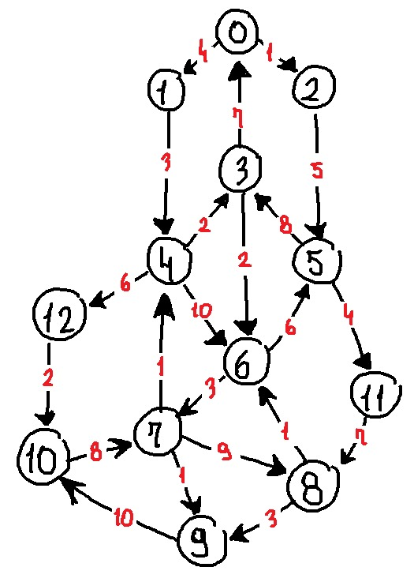
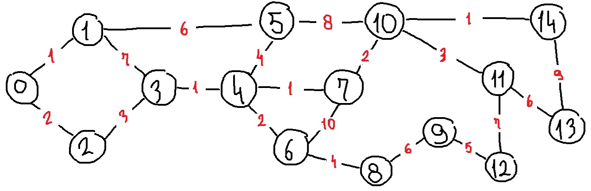
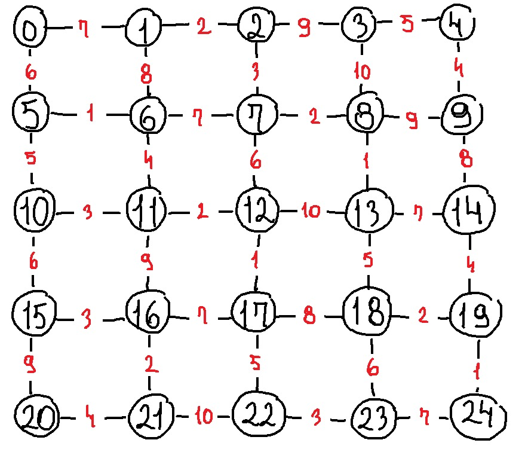

```md id="7kq2zm"
# 🤖 Algoritmos de Busca em IA (Dijkstra & A*)

Projeto desenvolvido para a disciplina de **Fundamentos de Inteligência Artificial**, com foco na implementação de algoritmos de busca em grafos.

- 🔵 **Dijkstra**
- ⭐ **A\*** com heurística de Manhattan

O projeto foi implementado em **Python**, abrangendo diferentes tipos de grafos:

- Grafos direcionados  
- Grafos não direcionados  
- Grafos em grade (grid)  

---

## 🚀 Objetivos

- Implementar algoritmos clássicos de busca  
- Explorar caminhos mínimos em diferentes estruturas de grafos  
- Aplicar heurísticas no algoritmo A*  
- Comparar abordagens em cenários distintos  

---

## 🧠 Algoritmos Implementados

### 🔵 Dijkstra
- Calcula o menor caminho com custo mínimo  
- Não utiliza heurística  
- Base para comparação com A*  

### ⭐ A* (A-Star)
- Utiliza **heurística de Manhattan**  
- Mais eficiente em grafos espaciais (como grids)  
- Muito usado em jogos e navegação  

---

## 📂 Estrutura do Projeto

```

📁 Trabalho-de-algoritmos-de-busca-IA<br>
├── 📁 img<br>
│ ├── Grafo_direcionado.jpg<br>
│ ├── Grafo_grid.jpeg<br>
│ └── Grafo_naodirecionado.jpg<br>
├── 📁 main<br>
│ ├── A_Estrela_Manhattan.py<br>
│ ├── grafo_dir.py<br>
│ ├── grafo_grid.py<br>
│ └── grafo_n_dir.py<br>
├── LICENSE<br>
└── README.md

````id="z1k9du"

---

## 🖼️ Exemplos de Grafos

### 📍 Grafo Direcionado
```md id="7p4l9n"

````

### 📍 Grafo Não Direcionado

```md id="g0z1bx"

```

### 📍 Grafo em Grid

```md id="6e3j1m"

```

---

## 🛠️ Tecnologias

* 🐍 **Python**
* Estruturas de dados (listas, filas de prioridade)
* Grafos
* Algoritmos de busca

---

## ▶️ Como executar

1. Acesse a pasta do projeto:

```bash
cd Trabalho-de-algoritmos-de-busca-IA
```

2. Execute um dos módulos:

### ▶️ A* com heurística de Manhattan

```bash id="k8f2pl"
python main/A_Estrela_Manhattan.py
```

### ▶️ Grafos direcionados

```bash id="0fwq1y"
python main/grafo_dir.py
```

### ▶️ Grafos não direcionados

```bash id="2y0yq8"
python main/grafo_n_dir.py
```

### ▶️ Grafo em grid

```bash id="7m3c9a"
python main/grafo_grid.py
```

---

## ⚖️ Comparação dos Algoritmos

| Algoritmo | Heurística | Caminho ótimo | Performance |
| --------- | ---------- | ------------- | ----------- |
| Dijkstra  | ❌ Não      | ✅ Sim         | Média       |
| A*        | ✅ Sim      | ✅ Sim*        | Alta        |

> *Desde que a heurística (Manhattan) seja admissível.

---

## 👥 Integrantes

* 👨‍💻 Eduardo
* 👩‍💻 Sarah
* 👨‍💻 Thiago

---

## 📄 Licença

Sugestão: **MIT License**

---

## 💡 Melhorias futuras

* Interface gráfica para visualização dos caminhos
* Animação da execução dos algoritmos
* Comparação de tempo de execução
* Suporte a entrada de dados externos

---

## 🌍 English Summary

**AI Search Algorithms (Dijkstra & A*)**

This project implements Dijkstra and A* (with Manhattan heuristic) in different graph types: directed, undirected, and grid-based graphs.

---

## 🏷️ Badges

```md id="m2u4i1"


